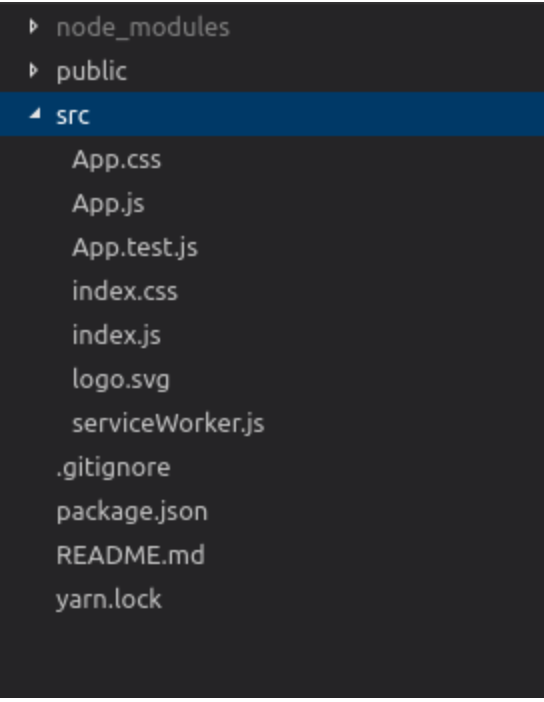

# 如何使用React Hooks构建电影搜索应用程序

> [阅读原文](https://www.freecodecamp.org/news/how-to-build-a-movie-search-app-using-react-hooks-24eb72ddfaf7/)

react hooks[点击查看](https://reactjs.org/blog/2019/02/06/react-v16.8.0.html)。众所周知这是一个令人兴奋的api。如果你对它还持有怀疑的态度，强烈建议你看一下这个[文章](https://medium.com/@dan_abramov/making-sense-of-react-hooks-fdbde8803889)，介绍了react开发团队为什么会推出hooks。

我们要做一个电影搜索的api，对应的电影搜索的api，用的是[OMDB api](http://www.omdbapi.com/)。类似国内的豆瓣，但是豆瓣api现在不是很稳定了。

在我们构建程序之前我们需要做一些事情：
- node>6
- a cool text Editor ,一个炫酷的编辑器
- an Api key from OMDB（可以从[这里](http://www.omdbapi.com/apikey.aspx)获得） <!-- ef28fe4c -->

好的，一旦有了，下一步就是设置react应用了。这里使用[creat-react-app](https://github.com/facebook/create-react-app)，创建应用。
```shell
npx create-react-app hookd
```

目录结构：


在这个应用程序里，我们将需要四个文件，下面是每个文件和它们的功能的概括：
- App.js: 其他三个组件的父组件。调用api
- Header.js 一个简单的头部组件，可以接受标题props
- Movie.js 它将渲染每一部电影。电影对象将通过prop简单的传入。
- Search.js 包含一个input表达和搜索按钮，包含一个重制参数的函数，还有通过props传入的搜索的完成的回调函数


多个useState如何组合在一起？useReducer就可以。对App.js进行改造